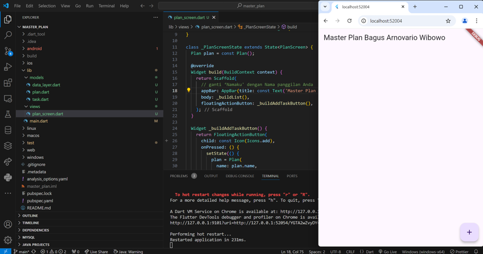
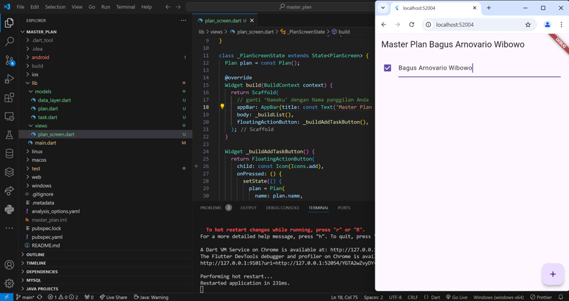
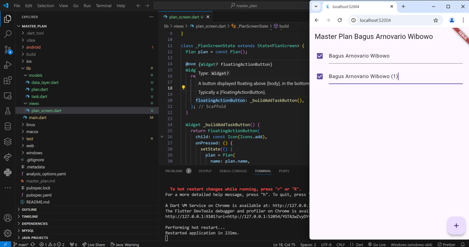
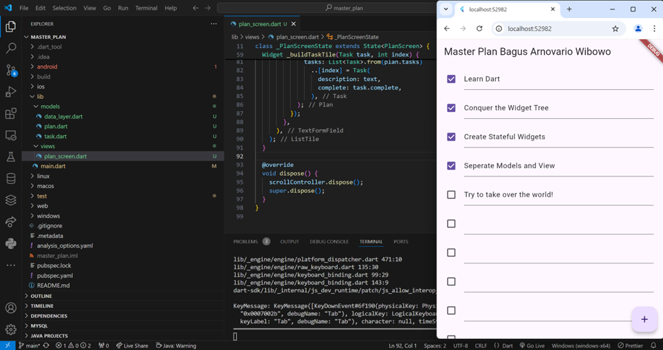
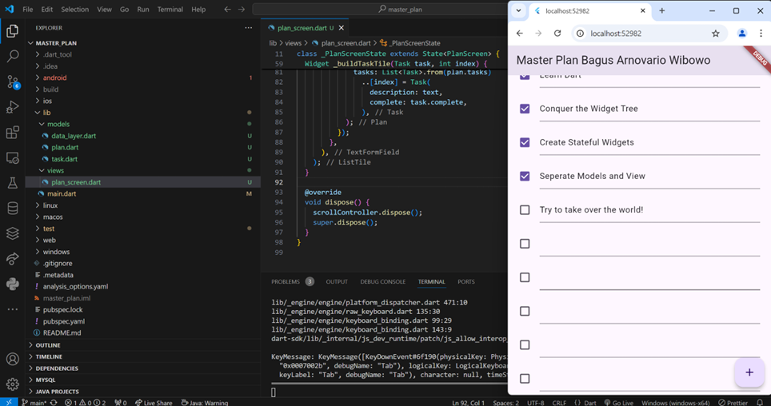

# Jobsheet 11 Dasar State Management

Nama : Bagus Arnovario Wibowo 
NIM : 2241720225

Hasil Praktikum 1 Langkah 1-9 
 
Terdapat title Master Plan disertai nama dan terdapat button add untuk menambahkan task. 

Setelah mengklik button add 
 
 
 
Setelah mengklik button add maka akan muncul list task yang bisa di check (centang) dan bisa ditambahkan sebanyak mungkin. 

Hasil Praktikum 1 Langkah 10-14 
 
 
Scroll Controller berfungsi agar user dapat menscroll list dari task yang ada jika jumlahnya terlalu banyak untuk ditampilkan, terutama untuk pengguna ios yang dimana ketika user menscroll maka keyboard akan otomatis menghilang ini mencegah masalah dimana TextField yang berada di bagian bawah layar tertutupi keyboard. 

Hasil Praktikum 1 Dasar State dengan Model-View 
 

Hasil Praktikum 2 Mengelola Data Layer dengan InheritedWidget dan InheritedNotifier 
 
Memisahkan view dan model, memanajemen state menggunakan InheritedNotifier, yang memungkinkan pembaruan data secara otomatis dan efisien. Pemanfaatan PlanProvider memungkinkan aplikasi untuk menambahkan, mengedit, dan menandai tugas selesai, serta menampilkan progressnya secara langsung. 

Hasil Praktikum 3 Membuat State di Multiple Screens 
 
Pada tampilan utama (PlanCreatorScreen) akan terlihat daftar rencana yang telah dibuat oleh user, setiap rencana ditampilkan dalam bentuk ListTile dengan nama rencana dan jumlah tasks yang telah selesai merupakan hasil dari method completenessMessage pada objek Plan. Terdapat kotak untuk menginput nama rencana pada tampilan utama, user diharapkan untuk menekan enter setelah mengetikkan nama rencana pada kotak input, setelah menekan enter maka rencana yang baru saja dibuat akan muncul pada daftar rencana di tampilan utama dibawah kotak input. Di dalam rencana yang dibuat, user dapat menambahkan tasks dan dikelola di PlanScreen. User bisa menandai tasks sebagai selesai dengan mencentang kotak pada sebelah kiri deskripsi tasks, dan user dapat mengubah deskripsi tasks, aktivitas ini memanfaatkan ValueNotifier untuk memperbarui data rencana secara otomatis di seluruh UI. Setiap daftar rencana dapat ditekan sehingga membuka tampilan dari PlanScreen yang berisikan deksripsi tasks dalam rencana tersebut. PlanProvider menggunakan InheritedNotifier untuk berbagi dan memantau data yang dikelola oleh ValueNotifierListPlan. Hal ini memungkinkan keseluruhan aplikasi menerima notifikasi pembaruan rencana secara efisien setiap adanya perubahan, semisal ketika rencana atau tugas baru ditambahkan, diedit, atau bahkan ditandai sebagai selesai. 
