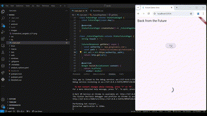
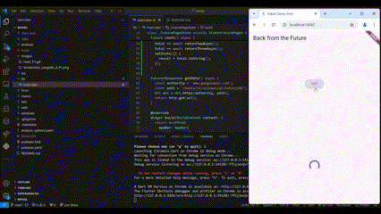
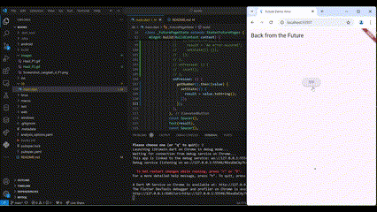
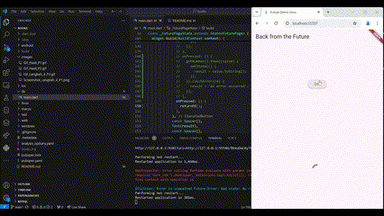
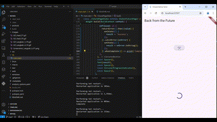
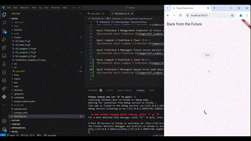
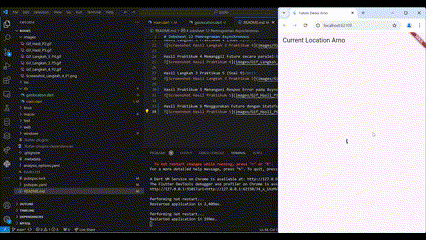
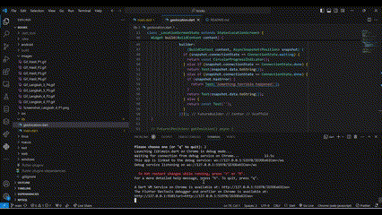

# Jobsheet 12 Pemrograman Asynchronous

Nama : Bagus Arnovario Wibowo 
NIM  : 2241720225 

Hasil Langkah 4 Praktikum 1 (Soal 2) 
 

Hasil Praktikum 1 Mengunduh Data dari Web Service (API) (Soal 3) 
 

Hasil Praktikum 2 Menggunakan await/async untuk menghindari callbacks (Soal 4) 
 

Hasil Langkah 4 Praktikum 3 (Soal 5) 
 

Hasil Praktikum 3 Menggunakan Completer di Future (Soal 6) 
 

Hasil Langkah 3 Praktikum 4 (Soal 7) 
 

Hasil Praktikum 4 Memanggil Future secara paralel 
 

Hasil Langkah 3 Praktikum 5 (Soal 9) 
 

Hasil Praktikum 5 Menangani Respon Error pada Async Code (Soal 10) 
 

Hasil Praktikum 6 Menggunakan Future dengan StatefulWidget (Soal 12) 
 

Hasil Langkah 4 Praktikum 7 (Soal 13) 
 

Hasil Praktikum 7 Manajemen Future dengan FutureBuilder (Soal 14) 
 

