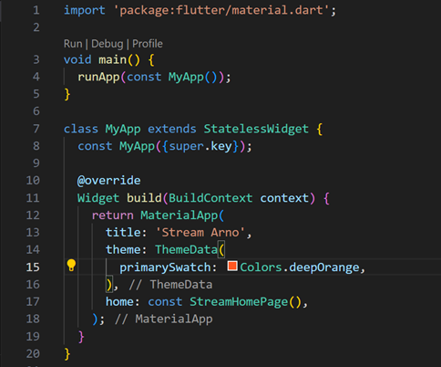
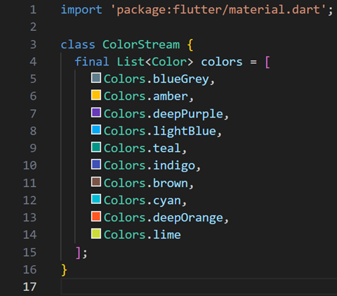
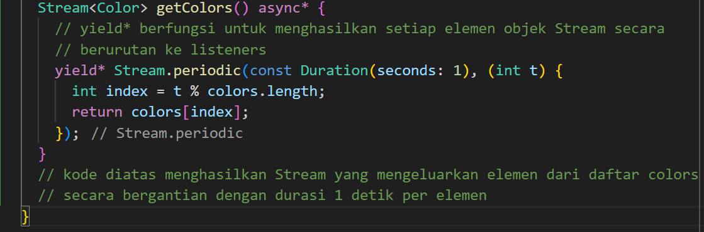
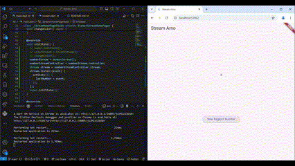
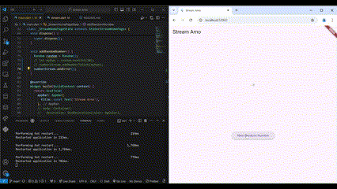
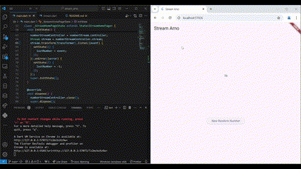
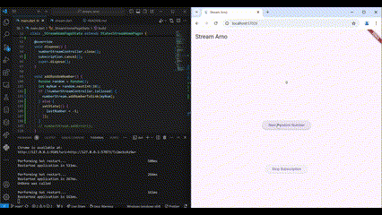
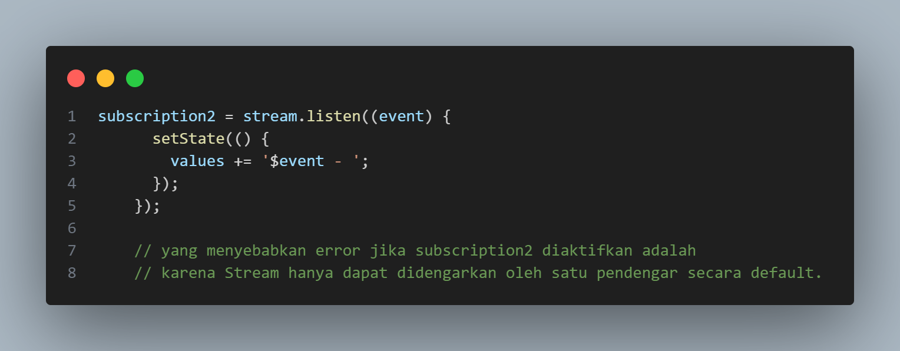
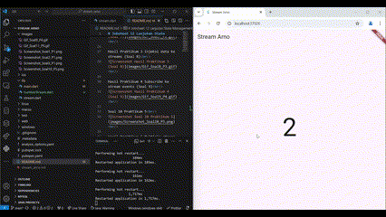
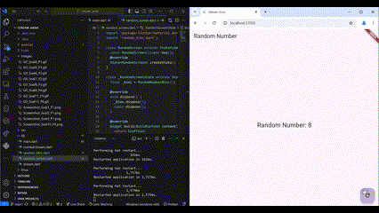

# Jobsheet 12 Lanjutan State Management dengan Streams

Nama\t: Bagus Arnovario Wibowo
NIM\t: 2241720225

Soal 1 Praktikum 1 
 

Soal 2 Praktikum 1 
 

Soal 3 Praktikum 1 
 

Soal 4 Praktikum 1 
 

Hasil Praktikum 1 Dart Streams (Soal 5) 
 

Soal 6 Praktikum 2 
 

Hasil Praktikum 2 Stream Controllers dan Sinks (Soal 7) 
 

Hasil Praktikum 3 Injeksi data ke streams (Soal 8) 
 

Hasil Praktikum 4 Subscribe ke stream events (Soal 9) 
 

Soal 10 Praktikum 5 
 

Hasil Praktikum 5 Multiple stream subscriptions (Soal 11) 
 

Hasil Praktikum 6 StreamBuilder (Soal 12) 
 

Hasil Praktikum 7 BLoC Pattern (Soal 13) 
 