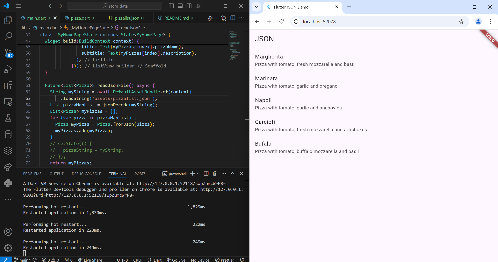
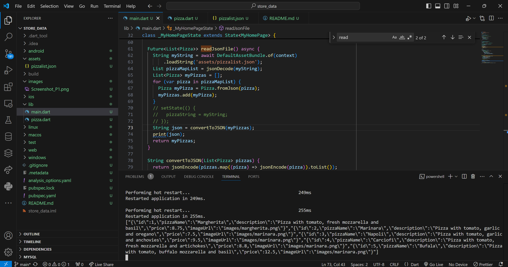

# Jobsheet 13 Persistensi Data

Nama : Bagus Arnovario Wibowo 
NIM  : 2241720225

Hasil Praktikum 1 Converting Dart models into JSON 
 

Hasil Praktikum 2 Reading the JSON file 
 

Hasil Praktikum 3 Saving data simply with SharedPreferences 
 

Hasil Praktikum 4 Accessing the filesystem, part 1: path_provider 
 

Hasil Praktikum 5 Accessing the filesystem, part 2: Working with directories 
 

Hasil Praktikum 6 Using secure storage to store data 
 