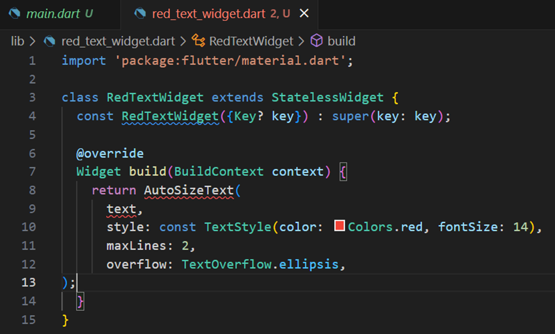
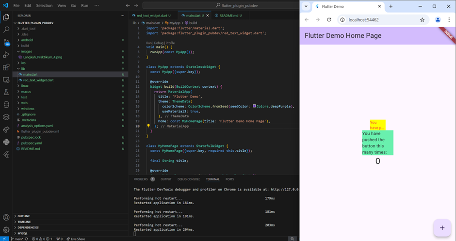

# Jobsheet 8 Manajemen Plugin

Nama : Bagus Arnovario Wibowo
NIM : 2241720225

Langkah Praktikum 4
 
Terdapat error dikarenakan tidak adanya perintah import untuk mengimpor package auto_sized_text di dalam file Dart dan variabel text yang belum dideklarasikan atau diinisialisasi.

Hasil Langkah Praktikum 1-6

Tugas :  
2. Maksud dari langkah 2 pada praktikum tersebut adalah untuk menambahkan plugin atau package yang bernama auto_sized_text secara otomatis. 
3. Maksud dari langkah 5 pada praktikum tersebut adalah untuk mendeklarasikan variabel text dengan tipe data String dan menambahkannya sebagai parameter di constructor. 
4. Fungsi :  
    - Fungsi pada widget pertama yaitu widget RedTextWidget adalah untuk menampilkan teks yang berwarna merah dan menggunakan AutoSizeText untuk menyesuaikan ukuran teks secara otomatis berdasarkan ruang yang tersedia, hingga maksimal dua baris. 
    - Fungsi pada widget kedua yaitu widget Text adalah untuk menampilkan teks sederhana dengan properti default. 
   Perbedaan : 
    - Pada widget pertama menggunakan AutoSizedText untuk menyesuaikan teks secara otomatis jika ruangnya terbatas dengan maksimal 2 baris, menampilkan teks dengan warna merah, dan memiliki lebar 50 piksel. 
    - Pada widget kedua menggunakan Text yang merupakan widget standar Flutter dan tidak bisa menyesuaikan teks secara otomatis, menampilkan teks dengan warna hitam default, dan memiliki lebar 100 piksel. 
5. Fungsi tiap parameter yang ada di dalam plugin auto_size_text : 
    - key : 
    Mengontrol bagaimana widget diganti oleh widget lain di dalam widget tree. 
    - textKey :  
    Menentukan key untuk widget Text yang dihasilkan. 
    - style : 
    Jika tidak null, menentukan gaya teks (warna, ukuran, berat, dll.) yang digunakan untuk menampilkan teks. 
    - minFontSize : 
    Ukuran minimum font yang akan digunakan saat menyesuaikan ukuran teks secara otomatis. 
    - maxFontSize : 
    Ukuran maksimum font yang akan digunakan saat menyesuaikan ukuran teks secara otomatis. 
    - stepGranularity : 
    Ukuran langkah dalam penyesuaian ukuran font. 
    - presetFontSizes : 
    Sekumpulan ukuran font yang telah didefinisikan sebelumnya. 
    - group : 
    Mengizinkan beberapa AutoSizeText untuk disinkronkan ukuran teksnya. 
    - textAlign : 
    Menentukan bagaimana teks disejajarkan secara horizontal dalam ruang yang disediakan (misalnya, kiri, kanan, tengah, atau justify). 
    - textDirection : 
    Mengontrol arah penulisan teks, seperti dari kiri ke kanan (ltr) atau kanan ke kiri (rtl). Ini penting untuk teks dalam bahasa tertentu seperti Arab atau Ibrani. 
    - locale : 
    Menentukan bahasa lokal yang digunakan untuk memilih font ketika karakter Unicode yang sama dapat ditampilkan secara berbeda tergantung pada lokal. 
    - softWrap : 
    Menentukan apakah teks akan dipotong di tempat jeda baris yang lembut (soft line breaks). 
    - wrapWords : 
    Menentukan apakah kata-kata yang tidak muat dalam satu baris harus dibungkus atau dipotong. 
    - overflow : 
    Menentukan bagaimana visual overflow harus ditangani. 
    - overflowReplacement :  
    Jika teks melampaui batas dan tidak muat dalam ruang yang tersedia, widget pengganti ini akan ditampilkan sebagai gantinya. 
    - textScaleFactor : 
    Mengontrol skala teks, yaitu jumlah piksel font untuk setiap piksel logis. 
    - maxLines :  
    Menentukan jumlah maksimum baris yang boleh digunakan oleh teks. 
    - semanticsLabel : 
    Menyediakan label semantik alternatif untuk teks ini. 